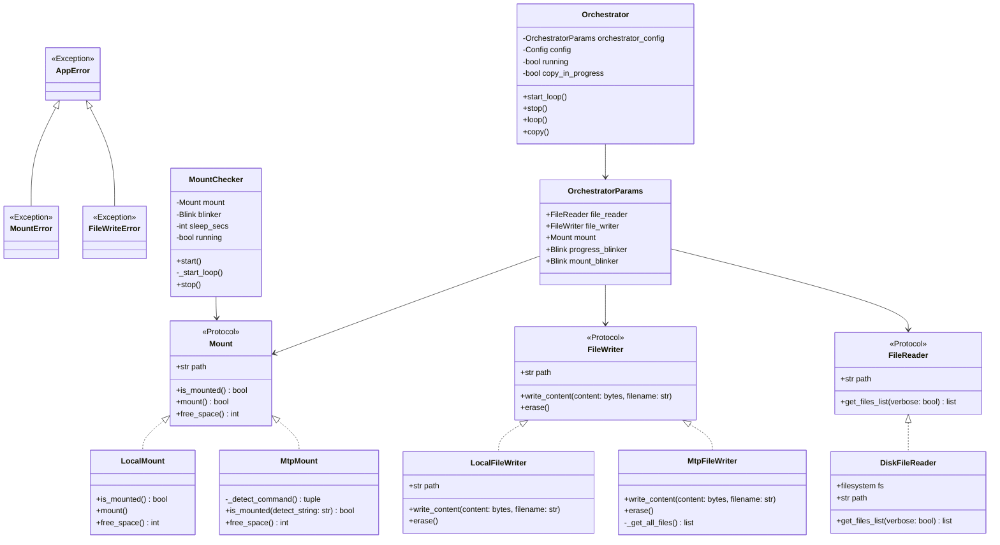

# JamWatch ⌚︎🎧


## Background

A while back I bought myself a [Garmin Forerunner 745](https://www.garmin.com/en-US/p/713363/) I've been very pleased with, one of the advantages being that it allow you to download [MP3](https://en.wikipedia.org/wiki/MP3) music and listen to it using bluetooth headset. However, this requires you to connect the watch to your computer using a <u>USB cable</u> and using the Garmin application chose which you wish to transfer.

The problem I wish to solve is that from my catalog of *<u>music</u>* ♫ want "something" to make selection based on your own criteria - such as you may wish to have a *<u>random</u>* selection where **75%** of the songs are from *year 2020* and **25%** based on your own *rated* ⭐️⭐️⭐️ or higher songs automatically for you with you doing anything.

As I had an older [Raspberry Pi 1B+](https://en.wikipedia.org/wiki/Raspberry_Pi) in my drawer, so with help of some coding, soldering and 3D printing made a small device where I could easily attach my watch and with a press a button 🔘 the process starts and thanks to the led(s) see the *<u>progress and completion</u>* 🟢.. Just to detach and go out for a jog with fresh new music based on your own choice 🏃‍♂️ ...


## Requirements and installation

```shell
# mtp-tool - https://launchpad.net/ubuntu/jammy/+package/mtp-tools
sudo apt-get install mtp-tools  # required for transfers
sudo apt-get install swig   # for building lgpio
sudo apt-get install liblgpio-dev  # for building lgpio
git clone https://github.com/engdan77/jamwatch.git && cd jamwatch
```

## Hardware schema

This is the basic wiring I've used for LEDs and button.


## Usage

### Start as server waiting for button event (example)

Ensure you have [UV](https://docs.astral.sh/uv/) installed available to root user - installation instructions [here](https://docs.astral.sh/uv/getting-started/installation/).

Create configuration file including your custom filters otherwise default created automatically at first run

```shell
sudo uv run jamwatch create-config
sudo uv run jamwatch show-config-path
sudo vi /root/.config/jamwatch/config.json
```

Example of such configuration file

```jso
{
    "distribution_stats": [
        {
            "filter": ">2020",
            "percentage": 50.0
        },
        {
            "filter": ">****",
            "percentage": 50.0
        }
    ],
    "max_mb_size": 128
}
```

* **distribution_stats** - supply filter based on package [here](https://github.com/engdan77/musicplayer) I created in the past, above example will fill half the memory with songs newer than year 2020 and next 50% filles with songs starred with 4 stars or higher randomly chosen.
* **max_mb_size** - depending how much you wish to transfer or limitation of your device.

Put your MP3 files into a folder such as **/home/user/mp3** as an example.

```shell
sudo uv run jamwatch start-server /home/user/mp3
```

Now you can press the "button" to start the transfer, or you can also explicitly start transfer by

```sh
sudo uv run jamwatch copy /home/user/mp3
```

### Help

```shell
$ uv run jamwatch --help

Usage: jamwatch COMMAND

╭─ Commands ───────────────────────────────────────────────────────────────────╮
│ copy              Copy files from a folder to a MTP device                   │
│ create-config     Create a new config file                                   │
│ show-config-path  Show the path to the config file                           │
│ show-free-space   Show the free space in the target device                   │
│ start-server      Start server that listens for button presses to start      │
│                   copying files                                              │
│ --help -h         Display this message and exit.                             │
│ --version         Display application version.                               │
╰──────────────────────────────────────────────────────────────────────────────╯
```


### Button and LEDs

- **Green LED** 🟢 - Indicates that a Garmin Forerunner being connected to USB
- **Red LED** 🔴 - Has the following stages once transfer been started
  - *Phase 1* (turned on) - Music meta data is being collected and transfer being prepared
  - *Phase 2* (rapid blinking) - Current music on device being erased
  - *Phase 3* (blinking from slow to fast) - To display progression 1% (slowly) - 100% (rapidly)
  - *Off* - Transfer is complete
- **Button** 🔘 - Click once to start transfer and red LED shall lid up if working correctly 


## Software design

### Reflections

It appears Garmin uses [MTP](https://en.wikipedia.org/wiki/Media_Transfer_Protocol) *(Media Transfer Protocol)*, and I was initially looking for a Python package that was able to directly through [libmtp](https://github.com/libmtp/libmtp) but the choices were very slim and outdated, next I looked in [jmtpfs](https://github.com/JasonFerrara/jmtpfs) to mount the device as part of the filesystem, but for reasons I cannot to explain I was unable to transfer songs to the device using this. So I leaned towards using [mtp-tools](https://packages.debian.org/unstable/utils/mtp-tools) instead. That involves calling upon it using [subprocess](https://docs.python.org/3/library/subprocess.html). This eventually turned out to work out the best for me.

As the Raspberry Pi being quite sluggish to work with I made the initial code using classes such as ***LocalMount*** and ***LocalWriter*** to test things out and the [gpiozero](https://gpiozero.readthedocs.io/en/stable/) helped as it does support [mocking pins](https://gpiozero.readthedocs.io/en/stable/api_pins.html#mock-pins) without need of device nor [GPIO pins](https://en.wikipedia.org/wiki/General-purpose_input/output) in your development environment.

If one prefer to read files directly from **FTP** you can easily replace the *DiskFileReader* with ***FtpFileReader*** (currently not used).

### Class diagram



