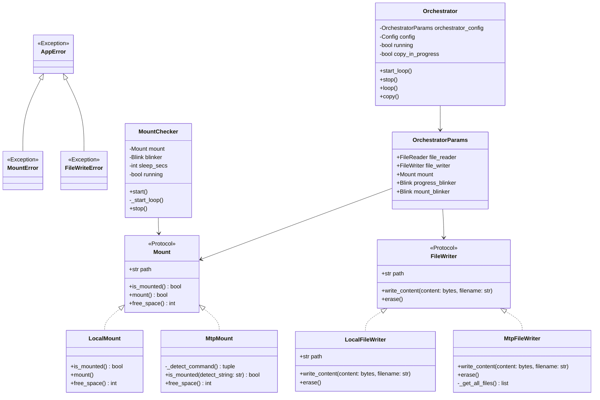

# JamWatch ⌚︎🎧

## Background

...

## Requirements

```shell
# mtp-tool - https://launchpad.net/ubuntu/jammy/+package/mtp-tools
sudo apt-get install mtp-tools
```

## Usage
### Start as server waiting for button event (example)

Ensure you have [UV](https://docs.astral.sh/uv/) installed available to root user - installation instructions [here](https://docs.astral.sh/uv/getting-started/installation/).

```shell
sudo uv run jamwatch start-server /home/user/mp3
```

## Software design

### Class diagram




## Notes for lgpio on Raspberry Pi
Requires for me install `lgpio` package run the following commands:
```shell
sudo apt-get install swig
sudo apt-get install liblgpio-dev
```

